# 学会使用这12个AI求职工具,五分钟搞定职位申请

求职过程中反复填写申请表格、逐条定制简历和跟踪数十个职位进度是最耗时的三大痛点。传统手工投递方式平均每份申请需要30-45分钟,而AI自动化求职工具通过智能简历匹配、一键批量投递和实时进度追踪,将单次申请时间压缩至2-3分钟。从免费基础版到企业级方案,选择合适的AI求职助手直接影响面试邀约数量、求职周期长度和最终入职成功率。本文精选12款经过市场验证的智能求职平台,覆盖简历优化、自动投递到面试准备的全流程需求,帮助求职者快速定位最适配自身职业发展的自动化解决方案。

***

## **[JobHire.AI](https://jobhire.ai)**

15天面试保障承诺,全流程AI自动化求职

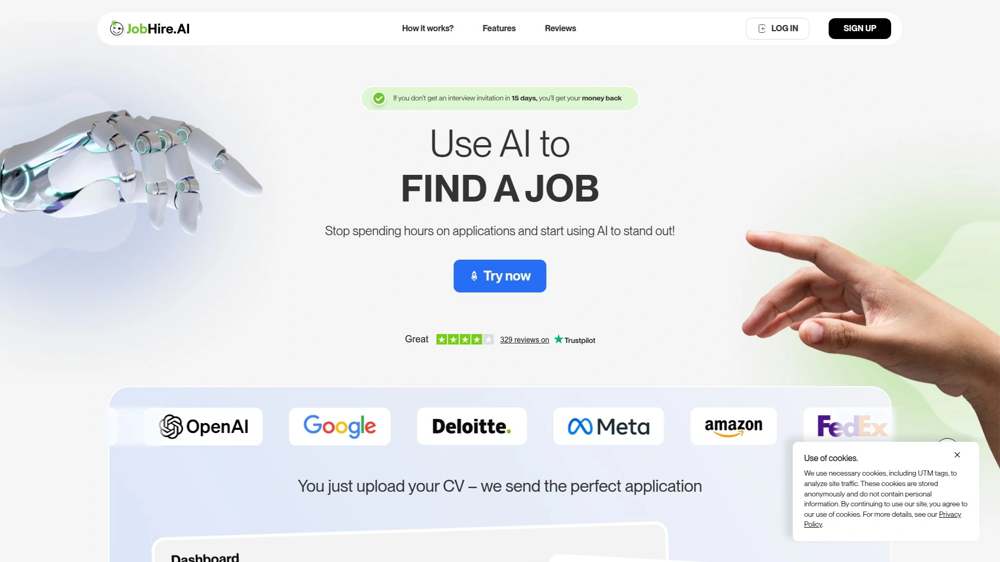

JobHire.AI是由AI驱动的求职工具平台,承诺用户在15天内未收到面试邀请即可获得全额退款。平台核心价值是让AI处理所有耗时的申请环节,用户只需上传简历并设置偏好,系统即可自动完成从简历优化到职位投递的全流程。

用户上传简历后,AI系统会分析内容并提供优化建议,确保简历符合ATS(申请人追踪系统)标准。自动生成的邮件和回复功能覆盖招聘方沟通的各个阶段,无需手动撰写每封沟通邮件。定制化求职信功能根据职位描述自动调整内容,强调最相关的技能和经验。

**时间节省与效果承诺**:平台声称每周可节省多达40小时申请时间,让用户专注面试准备和技能提升。超过1000万个职位等待匹配,覆盖各行业和技能水平。已有35000多名求职者通过JobHire.AI找到理想工作。

完成账户设置后,通常需要7-14天开始收到面试邀请,因为招聘人员需要时间审核资料。活动和结果追踪功能提供透明的申请进度可视化,用户随时了解投递状态和回复情况。JobHire.AI特别适合希望最大化申请数量的求职者、厌倦手工填表的专业人士、以及需要快速获得面试机会的紧急求职者。

***

## **[Teal](https://www.tealhq.com)**

一体化职业发展平台,90天追踪窗口回馈

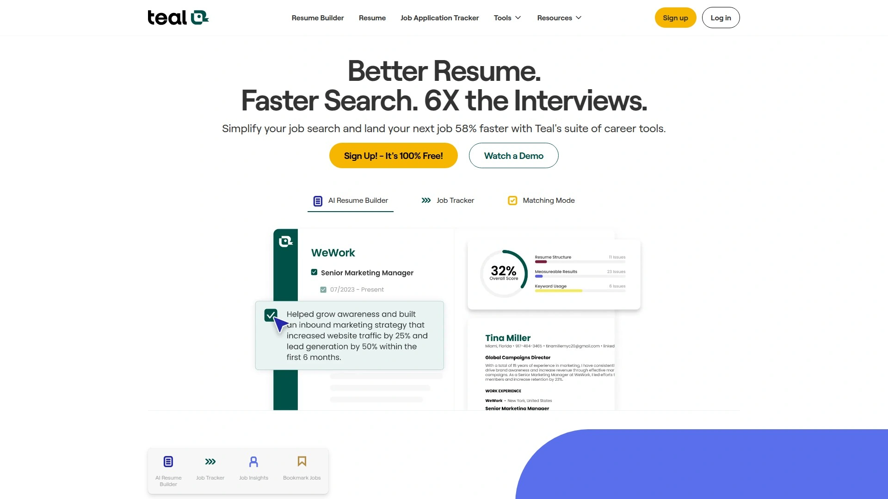

Teal是综合性职业成长平台,提供简历构建、职位追踪、面试准备和薪资谈判等全方位工具。平台设计理念是减轻求职压力,通过AI驱动的工具让申请过程更快速、更有效。

**核心功能矩阵**:AI简历构建器根据职位描述自动调整简历内容,确保关键词匹配度。职位追踪器集中管理所有申请,记录投递日期、公司信息和沟通历史。求职信生成器快速创建个性化求职信,节省从头撰写的时间。面试练习工具模拟常见面试问题,提供回答建议和改进反馈。

Teal的免费版本提供核心功能访问权限,Teal+付费版本解锁高级洞察,显示简历是否使用正确的关键词并提供优化建议。合作计划为每个通过推荐链接升级至Teal+的用户提供$20回馈,90天追踪窗口确保长期转化也能获得归因。

推荐计划鼓励用户分享平台给正在求职的朋友和同事,双方都能从中受益。Teal特别适合职业教练和内容创作者推荐给受众、需要系统化管理多个申请的求职者、以及重视长期职业发展规划的专业人士。

---

## **[LazyApply](https://lazyapply.com)**

批量自动投递先驱,5000份申请验证

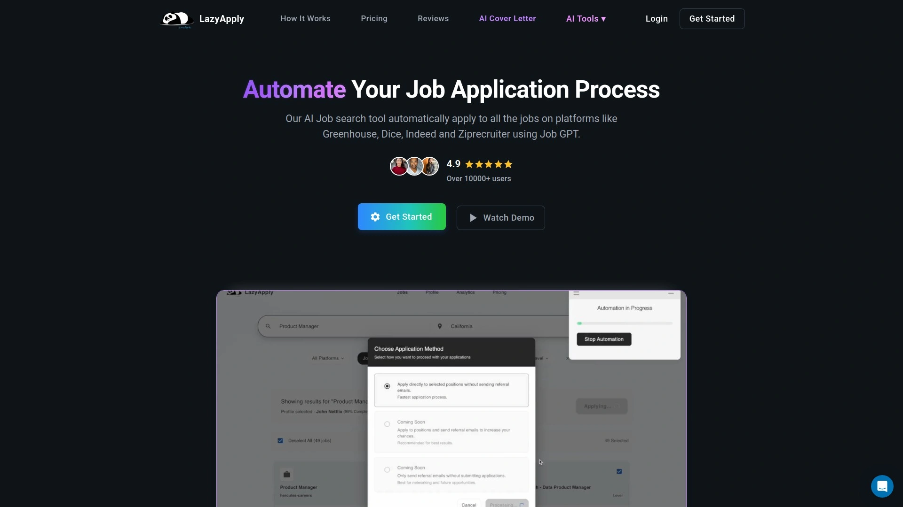

LazyApply是AI驱动的求职申请自动化工具,帮助用户在睡觉时也能完成职位投递。平台采用"求职是数字游戏"的理念,通过大量投递提升整体回应概率。

一位程序员使用LazyApply申请了5000个职位,展示平台的规模化能力。系统整合多个求职平台,自动填写申请表格并提交简历。但需注意平台主要支持"简易申请"功能的职位,可能错过需要复杂申请流程的机会。

**定价与适用场景**:月费$49起,提供批量职位申请功能。平台生成个性化申请内容,根据职位描述调整简历和求职信。申请进度追踪功能记录所有投递并提供改进建议。用户隐私和数据安全是优先考虑事项,所有信息加密存储。

LazyApply特别适合早期职业求职者需要广撒网、失业人员希望快速增加申请数量、以及时间紧张的在职跳槽者。但专业人士应注意,成熟职业发展更应强调质量而非数量,人脉推荐仍是获取工作的主要方式。

***

## **[Sonara](https://www.sonara.ai)**

每日自动筛选匹配,巴西团队质量把控

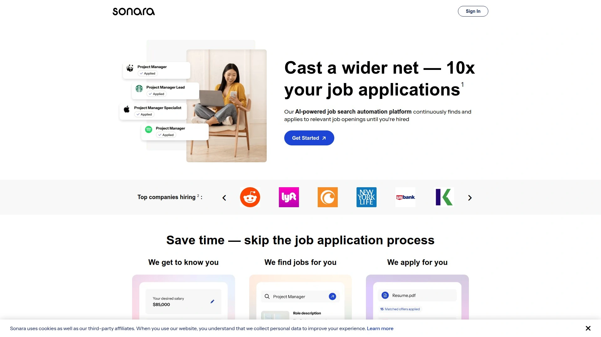

Sonara是全球首个全自动化职位申请管理平台,AI系统每天扫描数百万职位发布,筛选个性化匹配并在数秒内自动提交申请。创始人Victor Schwartz在杜克大学计算机和机器学习专业毕业时,因缺乏职业网络而在求职中屡遭挫折,于2019年开始开发Sonara。

**运营模式与用户规模**:平台最初雇佣巴西团队手动填写申请,2023年3月推出AI驱动服务,目前拥有5000名用户。Sonara正在开发自动定制简历功能,在提交前根据具体职位描述调整简历内容。月费$39起,每日自动申请相关职位。

平台整合LinkedIn、Indeed和Glassdoor等主流求职网站,方便导入个人资料。根据职位描述生成定制简历和求职信,强调最相关的技能。追踪申请状态并提供优化反馈,帮助用户持续改进材料质量。优先考虑用户隐私和数据安全,符合行业标准。

Sonara特别适合讨厌搜索职位的求职者、需要每日持续投递的被动求职者、以及缺乏行业人脉的应届毕业生。用户友好的界面和顶级反馈功能是主要优势,但完全访问权限需要支付较高费用。

***

## **[Rezi](https://www.rezi.ai)**

ATS优化专家,GPT技术先驱

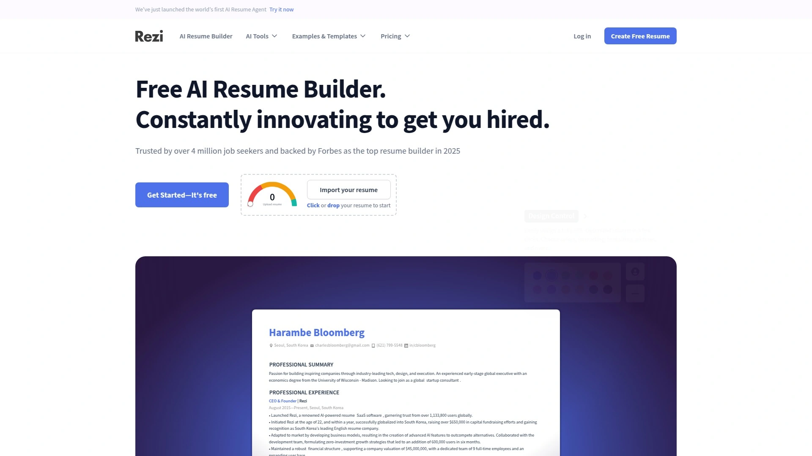

Rezi是专注简历内容质量的AI简历构建器,强制用户遵循最佳实践以确保获得面试机会。公司成立于2015年,是最早提供GPT驱动技术的简历平台之一,甚至早于ChatGPT-3发布。

**ATS优化核心技术**:Rezi深入研究简历如何通过申请人追踪系统(ATS),开发出能自动化整个简历创建流程的工具,包括针对职位描述优化简历的过程。2021年推出的自写简历软件能轻松瞄准职位描述,帮助求职者创建ATS友好简历。

AI工具箱包括AI简历构建器、AI简历编辑器、AI简历摘要生成器、AI面试模拟和AI关键词定向等功能。Rezi评分(Rezi Score)实时分析内容,提供改进建议。区块链验证功能为专业人士增加简历可信度。

定价从免费计划(1份简历限制,3次下载)到PRO计划$29/月,终身访问$149一次性付费。Rezi更专注简历内容优化,而Kickresume等竞争对手则强调视觉美观。Rezi特别适合需要突破ATS筛选的求职者、重视内容质量超过设计的专业人士、以及希望获得实时优化建议的用户。

---

## **[Kickresume](https://www.kickresume.com)**

视觉设计标杆,无限简历下载

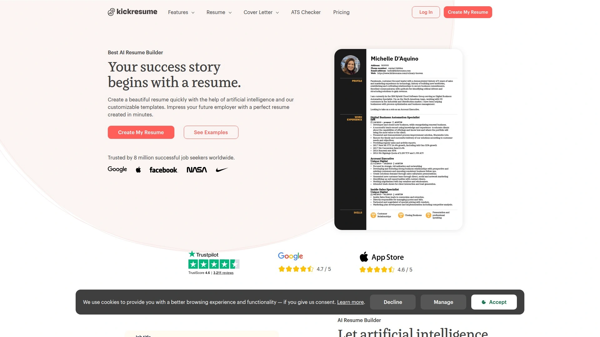

Kickresume是强调视觉呈现的AI简历构建器,为超过800万求职者提供服务。平台使用GPT-4驱动的AI简历撰写器,根据职位生成量身定制的完美简历。

**免费版本慷慨配额**:免费计划提供无限数量的简历和求职信创建及下载(使用免费定制选项),4个基础简历模板和4个匹配求职信模板。2200多份简历和求职信样本提供灵感参考。有限使用AI工具箱包括AI简历和求职信撰写器、辞职信生成器、面试问题生成器、简历改写器和简历检查器。

付费Premium计划从$19/月(月付)、$13/月(季付)到$7/月(年付),年度订阅额外赠送5位朋友各1个月Premium。学生和教师免费获得6个月Premium,完全访问所有功能和定制选项。移动应用支持iOS和Android双平台。

**差异化竞争优势**:Kickresume提供更多免费定制选项和无限下载,相比Rezi的1份简历3次下载限制更慷慨。AI职业教练帮助识别需要发展的技能,制定清晰行动计划达成职业目标。Career Map功能找到符合背景和目标的个性化职业路径,显示薪资信息和快速职位概览。

Kickresume特别适合重视简历视觉设计的创意行业求职者、需要创建多份简历的频繁换工作者、以及预算有限但需要专业外观的学生。

***

## **[LoopCV](https://www.loopcv.pro)**

被动求职者福音,持续自动匹配

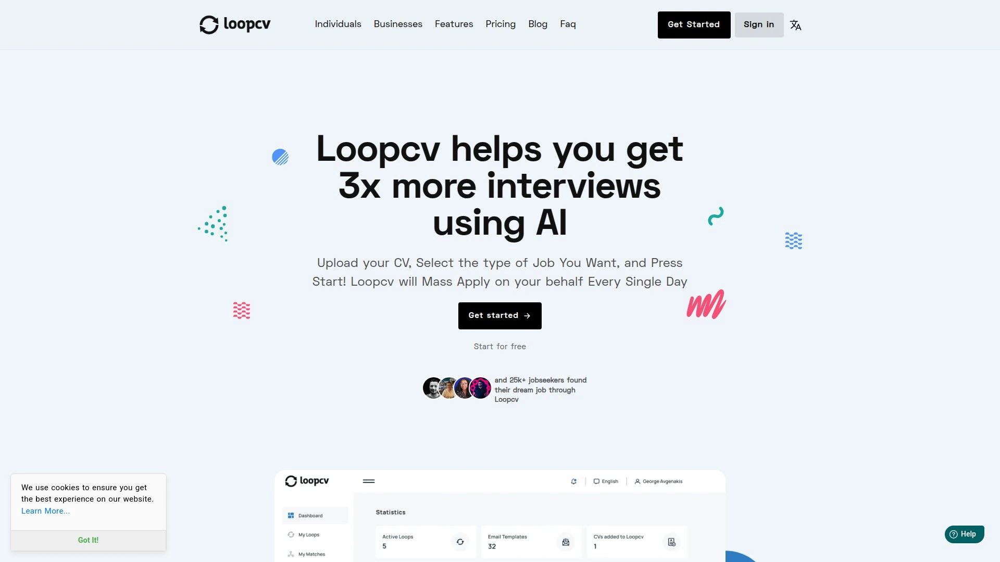

LoopCV是首个求职自动化平台,每天收集新职位发布,在用户期望的地点搜索工作并使用AI代表用户自动申请。平台定位被动求职者,即那些有工作但随时留意更好机会的专业人士。

**持续匹配机制**:用户设置偏好后,LoopCV持续在后台运行,自动发现和申请相关职位。整合LinkedIn等专业网络,方便导入个人资料。根据特定职位清单生成定制简历和求职信。追踪申请进度并提供改进建议。

定价从$15/月起,是同类工具中最实惠的选项。免费入门计划提供基础功能试用,清晰报告显示申请活动和结果。但设置每个新求职网站需要几个额外步骤。

LoopCV特别适合在职但随时准备跳槽的被动求职者、希望保持市场可见性的专业人士、以及需要长期持续投递的战略求职者。免费计划和透明定价降低试错成本。

---

## **[Huntr](https://huntr.co)**

30%高回馈率,地图视图创新

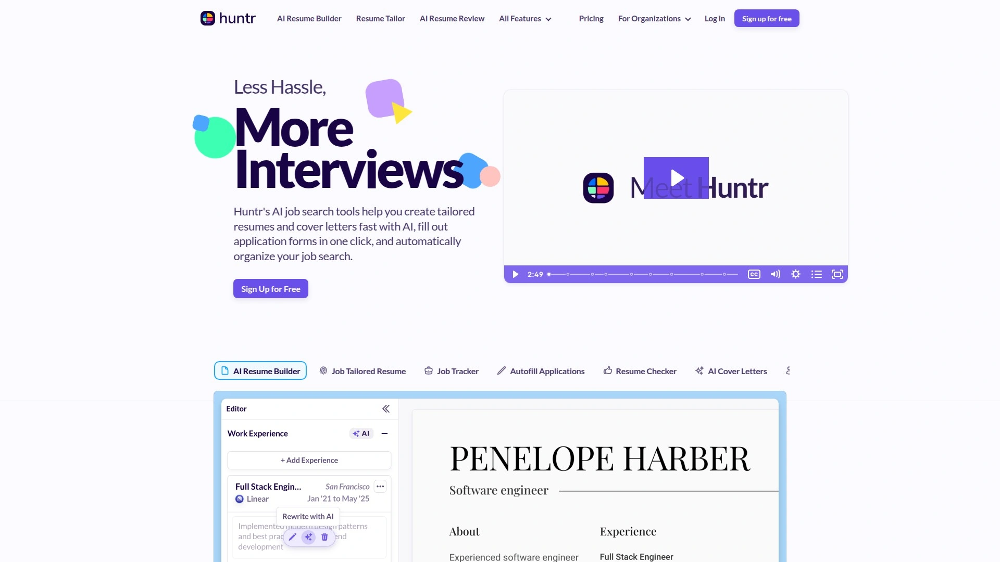

Huntr提供职位追踪、简历构建和LinkedIn优化的综合求职工具套件。平台的突出功能是地图视图工具,允许用户比较职位地理位置,特别适合考虑搬迁或远程工作的求职者。

**合作计划结构**:合作伙伴分享Huntr求职产品给受众,通过定制链接赚取30%回馈,适用于前3个月付款。月度订阅示例:用户点击链接注册Huntr Pro($40/月),推荐人每月获得$12,持续3个月。季度订阅示例:用户获取$90每季度的Pro计划,推荐人一次性获得$27。

Huntr帮助用户在数秒内创建定制简历和求职信,一键填写申请表格,自动组织求职搜索。AI驱动的简历定制功能确保每份申请针对具体职位优化。自动追踪系统记录申请状态、面试日期和跟进提醒。

Huntr特别适合创作者、博主和出版商希望赚取求职工具收益、管理多个申请需要可视化组织的求职者、以及重视一站式解决方案的用户。地图视图功能是市场上独特的差异化卖点。

***

## **[Jobscan](https://www.jobscan.co)**

ATS匹配度分析专家,3倍面试增长

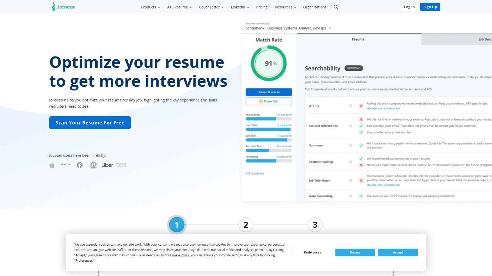

Jobscan是专业的ATS简历检查器和求职工具平台,帮助用户针对特定职位清单构建或优化简历,从而获得更多面试。平台核心价值是精确分析简历与职位描述的匹配程度,提供量化评分和改进建议。

**15%回馈计划**:合作伙伴推荐Jobscan可赚取15%订单回馈,并帮助求职者获得3倍更多面试。通过合作平台设置账户后,团队审核并批准,合作伙伴即可生成个性化链接。访问资产和资源包括图片、横幅和文本文案,帮助推广Jobscan。

仪表板提供链接点击、行动和销售的可见性,付款每月发出。禁止投标品牌关键词或在优惠券/折扣网站推广。Jobscan已帮助数十万用户改进简历和LinkedIn个人资料,获得更多面试或机会。

集成求职功能让用户直接在Jobscan内查看个性化职位列表,找到感兴趣的工作后优化简历并使用同一平台申请。与Job Tracker完美集成,一键保存职位并自动添加关键详情。Jobscan特别适合难以通过ATS筛选的求职者、需要量化优化指导的数据驱动型用户、以及重视面试转化率的专业人士。

***

## **[Resume Worded](https://resumeworded.com)**

20%回馈即时反馈,百万用户验证

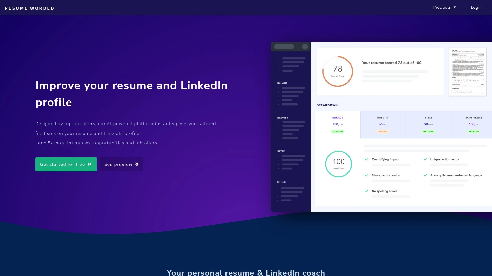

Resume Worded是AI驱动的职业平台,为简历和LinkedIn个人资料提供即时反馈。平台拥有超过百万求职者信任,提供极其先进且经过验证的职业工具包。

**合作计划特点**:合作伙伴推荐购买产品的用户可获得20%回馈(扣除支付处理费和增值税后)。赚取回馈无上限,可推荐任意数量的用户并从每个人获得回馈。适用于所有产品,包括Resume Worded Pro($39或$79)和LinkedIn Review Advanced($29)。

归因窗口20天,推荐用户无需立即购买,20天内购买推荐人仍获得全额回馈。每月通过PayPal、银行转账或Payoneer获得付款。平台强调帮助受众改善职业成果,推荐人因每位购买者获得奖金。

注意:截至2023年3月2日,合作计划暂时中断,因管理提供商关闭,团队正在迁移至新提供商。Resume Worded特别适合拥有职业发展受众的内容创作者、需要快速简历反馈的求职者、以及重视LinkedIn优化的专业人士。

***

## **[Careerflow](https://www.careerflow.ai)**

职业副驾驶,自动填表精准快速

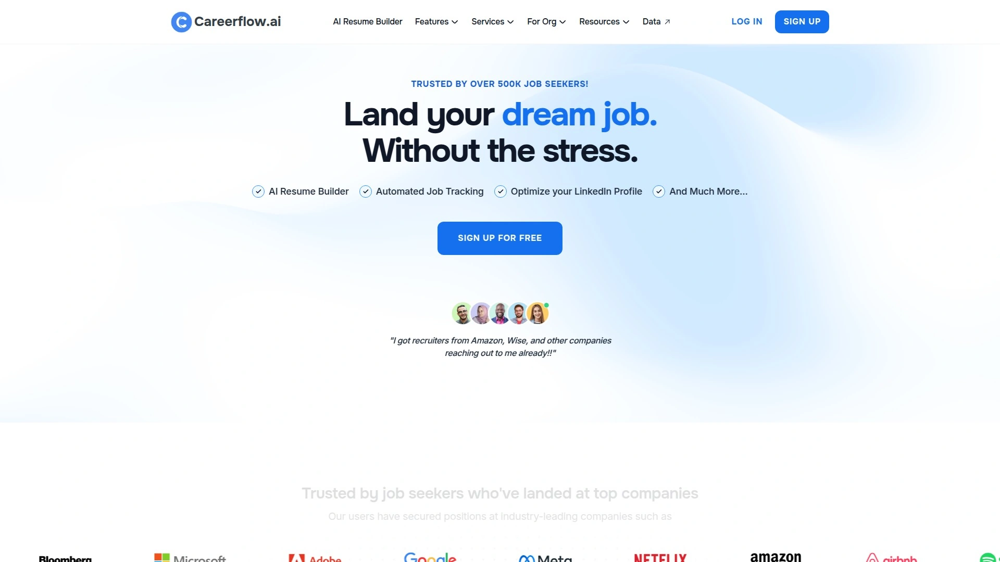

Careerflow是定位为"职业副驾驶"的强大AI求职工具平台,提供从简历优化到面试准备的全流程支持。自动填表工具以速度和精准度完成职位申请,确保每次输入一致且准确。

**AI工具集成矩阵**:求职追踪器集中管理所有申请,可视化展示求职漏斗各阶段进展。LinkedIn优化功能分析个人资料并提供改进建议,提升可见性和吸引力。简历构建器使用AI生成专业简历,针对特定行业和职位定制。面试准备模块提供常见问题和模拟练习,增强回答信心。

Careerflow在2025年最佳求职工具榜单中占据重要位置。平台强调数据驱动的洞察,帮助用户了解求职进度瓶颈并提供解决方案。自动填表功能显著减少重复劳动,每个职位节省10-15分钟。

Careerflow特别适合同时申请多个职位的求职者、需要LinkedIn存在感提升的专业人士、以及重视自动化效率的技术型用户。集成化平台消除在多个工具间切换的复杂性。

***

## **[AIApply](https://aiapply.co)**

个性化求职信专家,简历重写秒级完成

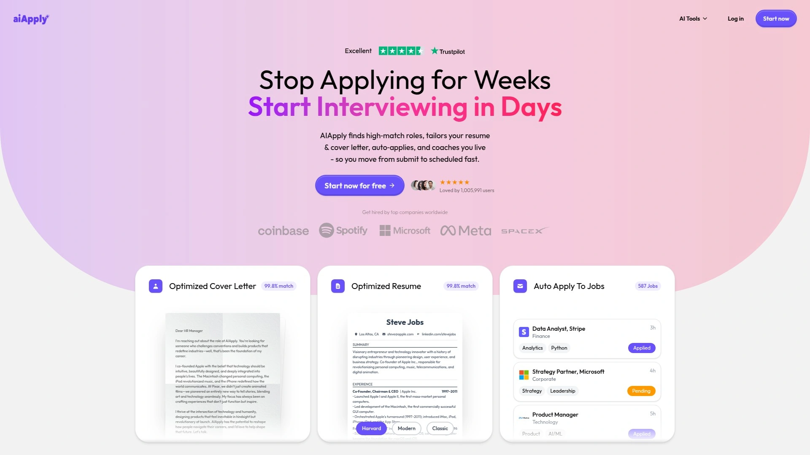

AIApply是AI驱动的求职合作伙伴,专注生成个性化求职信、重写简历并开启成功求职之旅。平台理念是让AI处理申请中的重复性工作,用户专注展示独特价值。

**核心AI能力**:求职信生成器根据职位描述和用户背景自动创建定制求职信,突出最相关的经验和技能。简历重写服务使用AI优化现有简历,改进语言、格式和关键词使用。快速生成功能在数秒内完成内容创作,显著加速申请流程。

AIApply确保每份生成的材料独特且针对性强,避免通用模板感。用户可以进一步编辑AI生成的内容,调整语气和细节以匹配个人风格。平台支持多种行业和职位级别,从入门到高管职位。

AIApply特别适合不擅长自我推销的求职者、英语非母语但需要专业文案的国际候选人、以及时间紧迫需要快速生成多份申请的用户。AI生成内容的质量和个性化程度是关键评估标准。

***

## **[WonsultingAI](https://www.wonsulting.ai)**

求职计划追踪,2倍面试速度

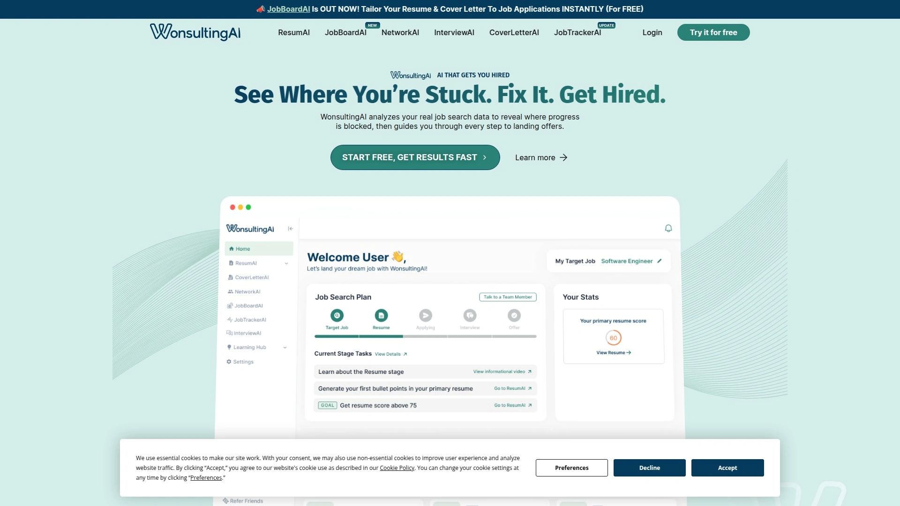

WonsultingAI通过分析真实求职数据揭示进展受阻的环节,然后逐步指导用户直至获得录用通知。平台核心洞察是75%的简历从未被人类招聘人员看到,60%的求职者申请后没有收到回复,仅2%的申请者被邀请面试。

**数据驱动求职方法论**:使用WonsultingAI的求职者获得面试的速度是使用传统方法的两倍。拥有已验证录用通知的用户,其由ResumAI生成的有说服力要点数量是其他人的3倍。平台提供从简历精炼和要点优化到求职信定制和社交外联的智能工具。

求职计划功能追踪整个求职过程,显示进度并提供下一步行动建议。AI工具帮助用户完成更多推动成效的申请、预订更多面试、签署更多录用通知。ResumAI免费简历构建器和AI反馈工具提供即时评分和个性化洞察,最大化求职市场机会。

WonsultingAI特别适合屡次被拒需要系统化改进的求职者、缺乏行业人脉的应届毕业生、以及重视数据驱动决策的专业人士。超过150万求职者使用平台验证其有效性。

***

## 常见问题

**AI自动投递工具会被招聘方识别吗?**

大多数现代AI求职工具使用先进算法模拟人类申请行为,包括随机化提交时间、个性化内容和自然语言生成。但部分招聘系统确实能检测批量或模板化申请。建议选择提供高度定制化的工具如JobHire.AI和Sonara,它们根据每个职位描述调整简历和求职信内容。同时避免完全依赖自动化,对重点目标公司仍应手动定制申请并添加个人化元素。优质工具如Massive甚至采用人工验证每份申请的正确性,确保质量。

**免费计划和付费升级的核心价值差异在哪里?**

免费计划通常提供有限的申请次数、基础简历模板和简化功能,如Rezi的1份简历3次下载限制。付费升级主要解锁无限申请数量、高级AI功能(如自动定制、ATS优化)、优先客户支持和详细分析报告。Kickresume的免费版提供无限简历和下载但仅4个模板,Premium解锁全部定制选项。Huntr和Jobscan的付费版提供更深度的职位追踪和匹配度分析。评估时需考虑求职紧迫性、目标职位数量和预算约束,急需大量投递的用户应选择LazyApply或Sonara的付费计划。

**如何选择自动投递工具还是简历优化工具?**

自动投递工具如LazyApply、Sonara和JobHire.AI专注快速批量申请,适合早期职业或数量导向型求职。简历优化工具如Rezi、Jobscan和Resume Worded深度改进简历质量,提升通过ATS和吸引招聘人员的概率。理想策略是组合使用:先用Jobscan或Rezi优化核心简历确保ATS友好性,然后用Teal或LoopCV的自动化功能规模化投递。成熟专业人士应优先质量和人脉推荐而非纯数量。评估自身求职阶段、行业竞争激烈程度和可投入时间,选择最匹配的工具组合。

***

## 总结

选择合适的AI求职工具需要综合评估自动化程度、简历优化能力和职位匹配精准度等多重因素。对于希望最大化申请效率并获得面试保障的求职者,[JobHire.AI](https://jobhire.ai)凭借15天面试承诺、每周节省40小时的全流程自动化和超过1000万职位覆盖,提供了从简历上传到面试邀约的完整解决方案。其AI驱动的邮件生成、求职信定制和活动追踪功能特别适合厌倦手工填表、需要快速增加申请数量的紧急求职者。无论最终选择哪个平台,建议先利用免费计划测试工具的申请质量和匹配准确度,观察7-14天内的面试邀约反馈,确保投资真正提升而非降低求职成功率。
